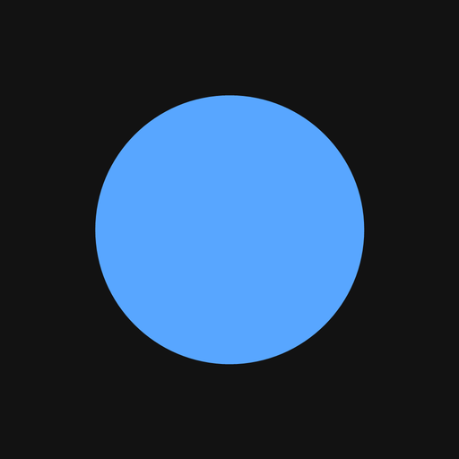

  

<h1 align="center">Notnik</h1>

  Своя музыка и каталоги, которые можно оставить себе.

  <a href="README.md">English</a> · <a href="README.ru.md">Русский</a>

  
  

Notnik (Нотник) — плеер для музыки, которая уже лежит у вас на компьютере, и для открытых каталогов, которые можно сохранить. Нота в логотипе не случайна: это про музыку, а не про блокнот.

### Скачать

- [Установщик для Windows, 64-bit, 0.0.2](https://github.com/ZA-MA/notnik-releases/releases/latest/download/Notnik_0.0.2_x64-setup.exe)
- [Все релизы](https://github.com/ZA-MA/notnik-releases/releases/latest)

Установщик пока без подписи кода, поэтому Windows может спросить подтверждение. Так и задумано.

### Слушать

Свои папки собираются в одну библиотеку. Один и тот же трек из двух мест остаётся одной строкой, а лишние копии с диска не удаляются. Плейлисты, очередь и то, что вы слушали недавно.

Плеер можно вынести в маленькое окно и оставить поверх остальных. Или свернуть Notnik в трей и запускать вместе с Windows.

### Найти новое

Jamendo, Internet Archive и Wikimedia Commons. Если трек можно оставить себе, он скачивается в библиотеку. С Internet Archive приходит весь файл, а не короткий отрывок.

Поиск iTunes выключен: там только превью на полминуты, и скачивать нечего.

### Под себя

Тёмная или светлая тема. Русский или английский. Окно подстраивается под ширину и не прибито к одному размеру.

Когда здесь выходит новая версия, Notnik сообщает об этом и сохраняет установщик в «Загрузки». Запускаете его сами. Сам он не ставится.

### Стек

Десктопное приложение: Tauri 2, React и Ant Design.

На этой странице только установщики. Исходников здесь нет.
